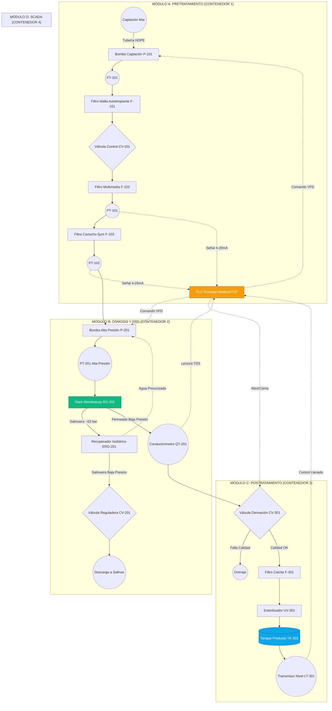

# ARQUITECTURA DE TUBERÍAS E INSTRUMENTACIÓN (P&ID)

Este documento describe la lógica de flujo, válvulas e instrumentación de la plataforma AQUA-8. La nomenclatura de equipos sigue el estándar ISA-S5.1.

## 1. Nomenclatura P&ID Básica
- **P-100:** Bombas (Pumps).
- **F-100:** Filtros (Filters).
- **V-100:** Válvulas Manuales (Valves).
- **CV-100:** Válvulas de Control / Solenoides (Control Valves).
- **PI / PT:** Indicador / Transmisor de Presión (Pressure Transmitter).
- **FI / FT:** Indicador / Transmisor de Flujo (Flow Transmitter).
- **QI / QT:** Analizador de Calidad (Conductividad/ORP).
- **RO-100:** Tren de Ósmosis Inversa.
- **ERD-100:** Dispositivo Recuperador de Energía (Isobárico).

---

## 2. Diagrama Lógico P&ID (Mermaid)

El siguiente diagrama detalla la interconexión de las tuberías (líneas continuas) y la instrumentación eléctrica (líneas punteadas hacia el PLC).

## 3. Criterios de Tuberías (Piping)
- **Baja Presión (Captación y Permeado):** PVC Cédula 80 o HDPE (Polietileno de Alta Densidad). Corrosión cero y bajo costo.
- **Alta Presión (RO y ERD):** Acero Inoxidable Dúplex (2205) o Super Dúplex (2507) para resistir presiones >65 bar y corrosión por cloruros a largo plazo.

## 4. Filosofía de Control (Lazos P&ID)
1. **Lazo de Calidad:** Si el conductivímetro `QT-201` detecta TDS > 500 ppm, el PLC abre inmediatamente la válvula desviadora de 3 vías `CV-301` enviando el agua al drenaje para evitar contaminar el tanque de almacenamiento `TK-301`.
2. **Lazo de Ensuciamiento:** Si el diferencial de presión entre `PT-101` y `PT-102` supera los 1.5 bar, el PLC dispara una alarma en AQUA-SCADA indicando que se debe cambiar el filtro de cartucho `F-103`.
3. **Lazo de Nivel:** Cuando el tanque `TK-301` llega al 100% de nivel (`LT-301`), el PLC entra en secuencia de apagado suave (Soft Stop), reduciendo progresivamente la velocidad de los variadores (VFD) de las bombas `P-101` y `P-201`.
