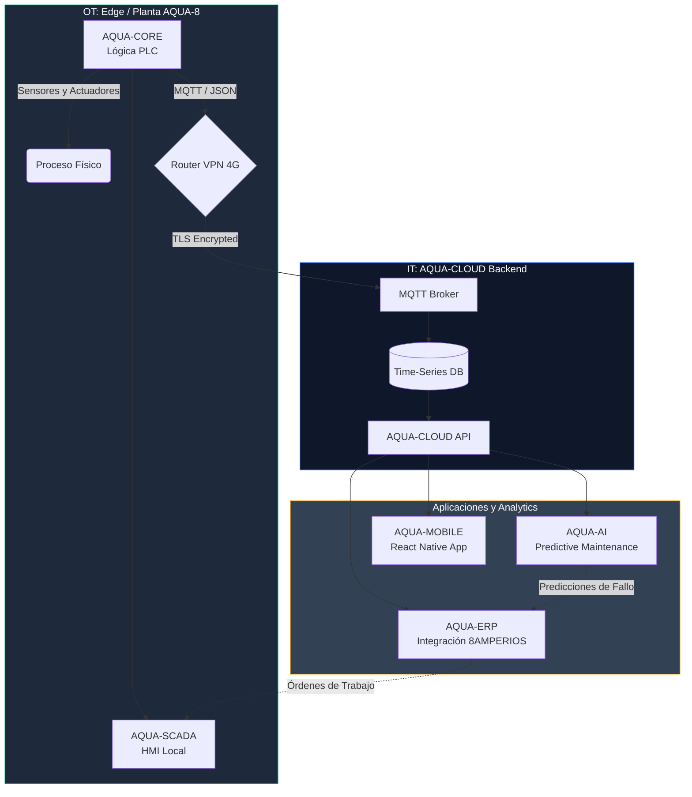

# ARQUITECTURA DE SOFTWARE Y ECOSISTEMA

AQUA-8 PLATFORM no es solo hardware; está concebida como una plataforma de software distribuida. El ecosistema se integra estrechamente con ERP-8AMPERIOS, fusionando la tecnología operativa (OT) con la tecnología de la información (IT).

## 1. Módulos del Ecosistema de Software

### 1.1 AQUA-CORE (Edge Computing)
Es el sistema nervioso local que corre dentro del PLC y la computadora Edge en el Módulo D (Contenedor Eléctrico).
- **Función:** Control PID local de lazos críticos (Bomba Alta Presión), rutinas de limpieza (CIP) y gestión de fallas locales.
- **Resiliencia:** Opera 100% offline. No depende de AQUA-CLOUD para producir agua de manera segura.
- **Edge Logging:** Recopila datos de sensores cada segundo y los promedia en búferes locales.

### 1.2 AQUA-SCADA (HMI y Operación)
La interfaz gráfica de operación en campo.
- **Función:** Permite al operador de la planta arrancar/parar la planta, visualizar alarmas y modificar Setpoints locales (con permisos de seguridad).
- **Tecnología:** Desarrollado sobre protocolos OPC-UA o WebHMI (ej. Ignition Edge, Node-RED).

### 1.3 AQUA-CLOUD (Data Lake & MQTT Broker)
La columna vertebral en la nube de la plataforma.
- **Función:** Recibe los streams de telemetría vía MQTT de todos los despliegues de AQUA-8 a nivel mundial.
- **Almacenamiento:** Base de datos de series de tiempo (Time-Series Database, ej. InfluxDB o TimescaleDB) diseñada para manejar millones de puntos de datos de telemetría al mes.
- **Acceso:** Expone una API REST/GraphQL para ser consumida por el resto del ecosistema.

### 1.4 AQUA-ERP (Integración con 8AMPERIOS)
El puente comercial y administrativo.
- **Función:** Convierte los m³ de agua producidos (telemetría) en métricas de facturación, contratos y gestión de activos.
- **Integración:** El ERP de 8AMPERIOS gestiona el inventario de repuestos (filtros, membranas). AQUA-ERP dispara órdenes de mantenimiento (Work Orders) automáticamente cuando las métricas de AQUA-CLOUD indican colmatación.

### 1.5 AQUA-MOBILE (App para Comunidades)
Aplicación para dispositivos móviles enfocada en el usuario final y operadores de campo.
- **Función:** Permite a los líderes comunitarios (ej. Manaure) visualizar en tiempo real si hay agua disponible en el tanque de la comunidad, así como recibir alertas de racionamiento.

### 1.6 AQUA-AI (Machine Learning)
Módulo de Inteligencia Artificial alimentado por los datos masivos de AQUA-CLOUD.
- **Función (Mantenimiento Predictivo):** Modela la tasa de ensuciamiento de las membranas de Ósmosis Inversa (Fouling Rate) analizando curvas de presión diferencial a lo largo del tiempo, prediciendo exactamente qué día se necesita un lavado químico (CIP) antes de que la membrana sufra un daño irreversible.

---

## 2. Diagrama de Arquitectura de Software

